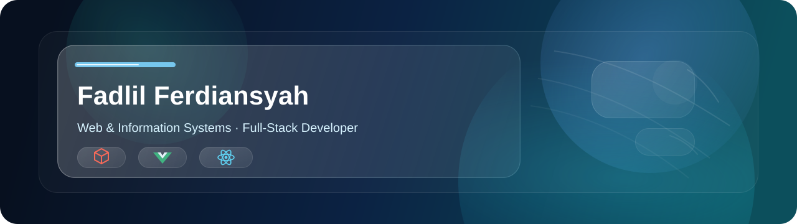
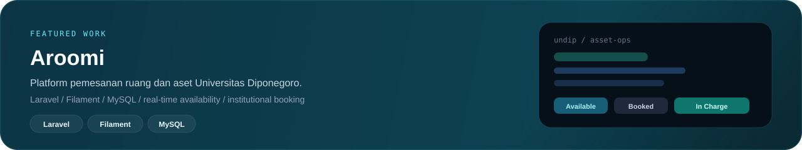
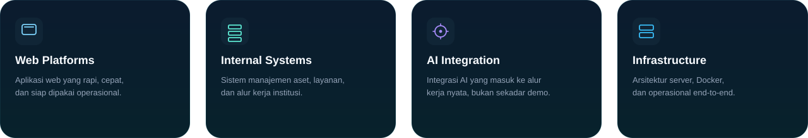
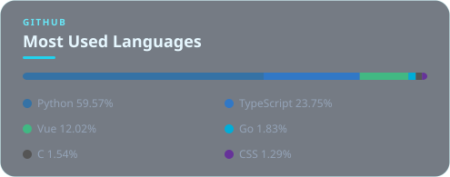

# 

  
  
  
  
  

  Staf IT &amp; Application Developer di <strong>BP UBIKAR Universitas Diponegoro</strong>. 
  Fokus pada aplikasi web, sistem manajemen internal, dan integrasi AI — dari arsitektur sampai aset yang benar-benar dipakai.

## Featured Work

## Focus

## Tech Stack

<table>
  <tr>
    <td valign="top" width="33%">
      
<strong>Frontend &amp; Mobile</strong>

      
      
      
      
      
      
    </td>
    <td valign="top" width="33%">
      
<strong>Backend &amp; Data</strong>

      
      
      
      
      
      
      
    </td>
    <td valign="top" width="34%">
      
<strong>Cloud &amp; Ops</strong>

      
      
      
      
      
      
    </td>
  </tr>
</table>

## GitHub Statistics

<table>
  <tr>
    <td width="50%" align="center" valign="middle">
      
    </td>
    <td width="50%" align="center" valign="middle">
      
    </td>
  </tr>
</table>

  <picture>
    <source media="(prefers-color-scheme: dark)" srcset="https://raw.githubusercontent.com/Ferxeegs/Ferxeegs/output/galaga-contribution-graph-dark.svg" />
    <source media="(prefers-color-scheme: light)" srcset="https://raw.githubusercontent.com/Ferxeegs/Ferxeegs/output/galaga-contribution-graph.svg" />
    
  </picture>

  

  Semarang, Indonesia · ferxcode.my.id

